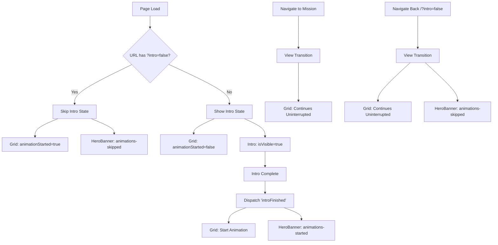

# View Transitions Design Document

## Overview

This document defines the architecture and implementation of smooth view transitions in the Augur teaser website, enabling seamless navigation between pages while maintaining continuous grid animation and providing optimal user experience.

### User Experience Goals

- **Continuous Animation**: Grid background animation never restarts during navigation
- **Smooth Transitions**: No black overlays, flashes, or visual interruptions
- **Smart Animation Skip**: Returning users skip intro sequence for faster access
- **Responsive Navigation**: Immediate visual feedback with no delays

## Architecture Overview

### High-Level Design

```
┌─────────────────────────────────────────────────────────────┐
│                      Layout.astro                          │
│  ┌─────────────────┐  ┌─────────────────────────────────┐   │
│  │   ClientRouter  │  │    PerspectiveGridTunnel       │   │
│  │   (Astro SPA)   │  │    (Persistent Animation)      │   │
│  └─────────────────┘  └─────────────────────────────────┘   │
│                                                             │
│  ┌─────────────────────────────────────────────────────┐   │
│  │                 <slot />                            │   │
│  │         (Page-specific content)                     │   │
│  └─────────────────────────────────────────────────────┘   │
└─────────────────────────────────────────────────────────────┘
```

### Core Components

1. **ClientRouter**: Enables SPA-style navigation with view transitions
2. **PerspectiveGridTunnel**: Persistent animated background hoisted to layout level
3. **Page Content**: Dynamically swapped content via view transitions
4. **State Management**: Global state preservation across navigation

## Component State Management

### State Flow Architecture



### Global State Structure

```typescript
// Global persistent state for animation continuity
declare global {
  interface Window {
    __perspectiveGridState?: {
      frameCount: number;           // Current animation frame
      animationFrameId: number | null;  // Active requestAnimationFrame ID
      isAnimating: boolean;         // Animation state flag
    };
  }
}
```

### Component State Definitions

| Component | State | Description |
|-----------|-------|-------------|
| **PerspectiveGridTunnel** | `animationStarted: boolean` | Controls when grid animation begins |
| **Intro** | `isVisible: boolean` | Controls intro display/hide |
| **HeroBanner** | CSS Classes | `animations-started` or `animations-skipped` |

## Navigation Flow Diagrams

### Initial Homepage Visit

```
User visits "/" 
    ↓
Layout renders with PerspectiveGridTunnel (animationStarted=false)
    ↓
Intro component shows (isVisible=true)
    ↓
Intro sequence completes
    ↓
Dispatches 'introFinished' event
    ↓
Grid starts animation + HeroBanner shows with animations
```

### Navigation to Mission Page

```
User clicks "REIMAGINED, TRANSFORMED, REFRESHED" link
    ↓
ClientRouter initiates view transition
    ↓
astro:before-swap → astro:after-swap → astro:page-load
    ↓
Grid animation continues uninterrupted (persistent component)
    ↓
Mission page content swaps in
```

### Return Navigation with Skip

```
User clicks "← BACK TO HOME" (/?intro=false)
    ↓
ClientRouter initiates view transition  
    ↓
astro:after-swap + astro:page-load events fire
    ↓
Intro component: URL param detected → isVisible=false immediately
    ↓
HeroBanner: Event handlers apply 'animations-skipped' class
    ↓
Grid continues + Homepage content shows immediately
```

## Implementation Patterns

### 1. Persistent Component Pattern

**Location**: Layout.astro
```astro
<PerspectiveGridTunnel 
  client:load 
  animationStarted={!isHomepage} 
  numLines={12} 
  animationSpeed={0.1} 
  maxOpacity={0.1} 
  lineColor="#2AE7A8" 
/>
```

**Component Implementation**:
```tsx
// Stable ID for view transitions
const COMPONENT_ID = 'perspective-grid-tunnel';

return (
  <canvas
    ref={canvasRef}
    id={COMPONENT_ID}
    data-astro-transition-persist={COMPONENT_ID}
    style={{
      position: 'fixed',
      top: 0,
      left: 0, 
      width: '100%',
      height: '100%',
      zIndex: 0,
      opacity: opacity,
      background: 'transparent', // Critical: no black background
    }}
  />
);
```

### 2. URL Parameter Navigation

**Mission Page Back Button**:
```astro
<a href="/?intro=false" class="back-nav-button">
  <span class="back-arrow">←</span>
  <span>BACK TO HOME</span>
</a>
```

**Intro Component Detection**:
```tsx
const [isVisible, setIsVisible] = useState(() => {
  if (typeof window !== 'undefined') {
    const params = new URLSearchParams(window.location.search);
    return params.get('intro') !== 'false';
  }
  return true;
});
```

### 3. View Transition Event Handling

**HeroBanner Multi-Event Pattern**:
```typescript
function forceShowElements() {
  const newParams = new URLSearchParams(window.location.search);
  if (newParams.get('intro') === 'false') {
    if (heroBanner) {
      heroBanner.classList.remove('animations-started');
      heroBanner.classList.add('animations-skipped');
      firstMenuItem?.focus();
    }
  }
}

// Multiple events for reliability
document.addEventListener('astro:page-load', forceShowElements);
document.addEventListener('astro:after-swap', forceShowElements);
```

### 4. CSS Animation States

**Hidden by Default**:
```css
#discord-link,
#twitter-link, 
#github-link,
#is-rebooting-text,
#line-left,
#line-right,
#prediction-market-text,
#menu-items-container a {
  opacity: 0;
}
```

**Skip State Override**:
```css
#hero-banner-container.animations-skipped #discord-link,
#hero-banner-container.animations-skipped #twitter-link,
#hero-banner-container.animations-skipped #github-link,
#hero-banner-container.animations-skipped #is-rebooting-text,
#hero-banner-container.animations-skipped #line-left,
#hero-banner-container.animations-skipped #line-right,
#hero-banner-container.animations-skipped #prediction-market-text,
#hero-banner-container.animations-skipped #menu-items-container a {
  opacity: 1;
  transform: none;
}
```

## Critical Implementation Guidelines

### CSS Considerations

❌ **Avoid**: 
- `background: 'black'` on persistent components
- CSS `transition: 'opacity 2s ease-in'` on persistent elements
- Fixed positioning with dark backgrounds that can flash

✅ **Use**:
- `background: 'transparent'` for persistent canvas elements
- Programmatic opacity control instead of CSS transitions
- View transition events for state management

### Event Timing

- **astro:page-load**: Reliable for URL parameter checks
- **astro:after-swap**: Immediate DOM update reactions
- **Custom Events**: `introFinished` for component coordination

### State Persistence

- Use global `window.__perspectiveGridState` for animation continuity
- Implement `data-astro-transition-persist` with stable IDs
- Handle component re-initialization gracefully

## Troubleshooting Guide

### Common Issues

**Problem**: Black overlay during transitions
- **Cause**: Fixed positioned component with dark background
- **Solution**: Use `background: 'transparent'` and remove CSS transitions

**Problem**: Homepage animations don't show after navigation
- **Cause**: Event handlers not firing or URL params not detected
- **Solution**: Use multiple event listeners and check URL parsing

**Problem**: Grid animation restarts on navigation  
- **Cause**: Component remounting instead of persisting
- **Solution**: Ensure stable ID and `data-astro-transition-persist`

**Problem**: Back button delays or doesn't work
- **Cause**: Complex JavaScript causing interference
- **Solution**: Simplify event handlers, remove timeouts

### Debugging Tools

1. **Browser DevTools**: Check element classes during transitions
2. **Console Logging**: Add temporary logs to event handlers
3. **Network Tab**: Verify no unnecessary refetches during transitions
4. **Animation Frame**: Monitor `requestAnimationFrame` IDs for continuity

## Testing Strategy

### Manual Testing Checklist

- [ ] Initial homepage visit shows intro sequence
- [ ] Grid animation starts after intro completion
- [ ] Navigation to mission page keeps grid running
- [ ] Back navigation skips intro and shows content immediately
- [ ] No black flashes or overlays during any transition
- [ ] Browser back/forward buttons work correctly
- [ ] Direct URL access to `/?intro=false` works

### Automated Testing Considerations

- Test URL parameter parsing logic
- Verify event handler attachment/cleanup
- Check CSS class application timing
- Validate state persistence across navigation

This design document serves as the authoritative reference for view transitions implementation and troubleshooting in the Augur teaser website.